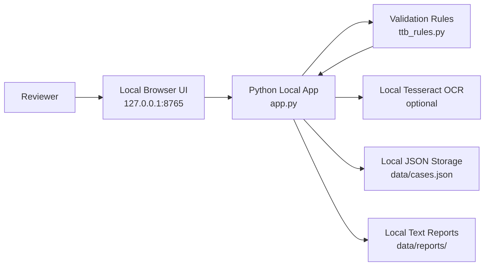
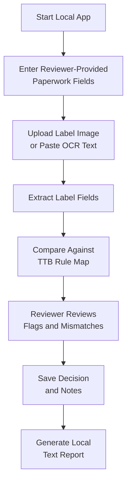

# Architecture

## Local-Only Prototype Architecture

## Review Workflow

## Key Design Decisions

- **Python standard library app shell:** keeps the prototype portable and avoids dependency-install risk during the job-test demo.
- **Local browser UI:** gives a clean reviewer workflow without requiring a full desktop framework.
- **Tesseract adapter:** uses local OCR when available, while still supporting pasted OCR text for demo reliability.
- **Rules module separation:** keeps regulatory checks separate from the UI.
- **JSON storage:** simple Phase 5 submission artifact; production should replace it with encrypted storage.
- **Reviewer-in-the-loop:** flags problems for human confirmation instead of making final legal determinations.

## Production Evolution

```mermaid
flowchart LR
    prototype["Current Prototype"]
    encrypted["Encrypted Storage"]
    auth["Role-Based Access"]
    audit["Tamper-Evident Audit Logs"]
    package["Signed Desktop Package"]
    validation["Accuracy Benchmarking"]
    pilot["Controlled Pilot"]

    prototype --> encrypted
    encrypted --> auth
    auth --> audit
    audit --> package
    package --> validation
    validation --> pilot
```

